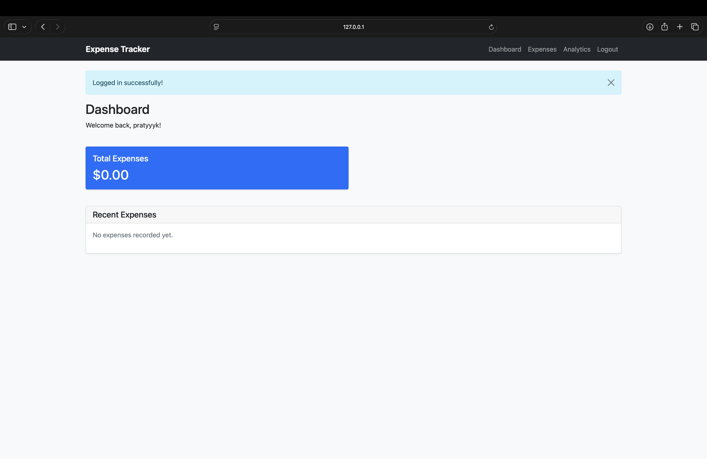
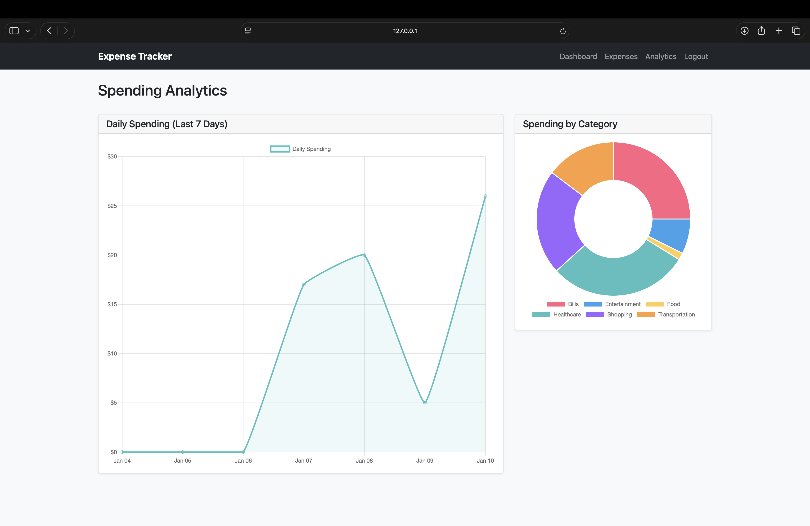
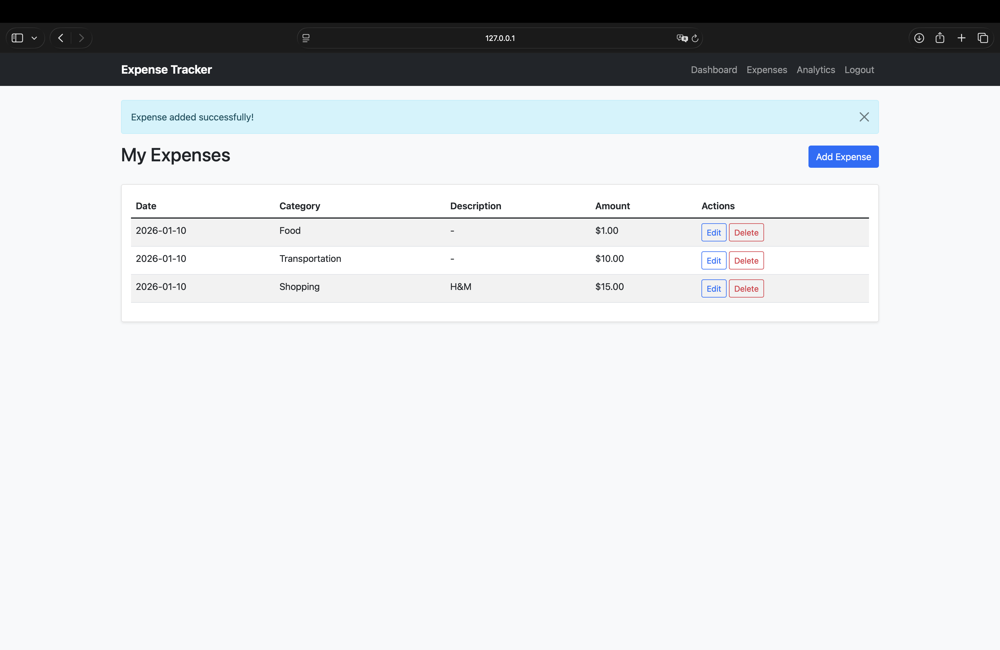
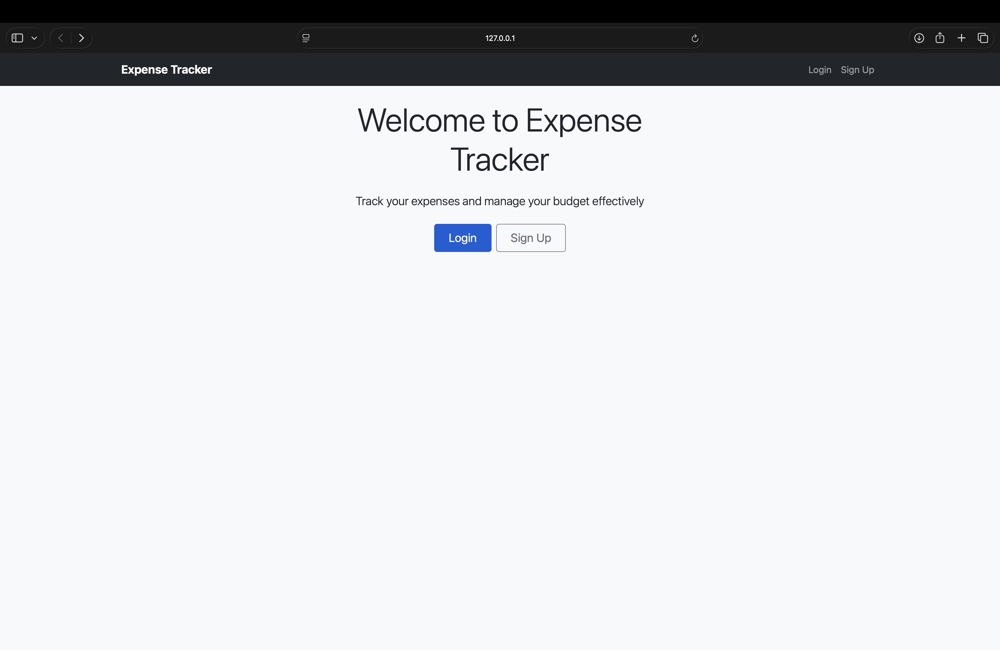

# 💳 EXPENCE Tracker Application

**Take control of your finances.** This comprehensive Expense Tracker application allows users to log daily spending, categorize expenses, and visualize financial habits through dynamic, interactive charts. Built with security and scalability in mind using Flask and SQLite.

---

## 📖 Table of Contents
- [✨ Key Features](#-key-features)
- [📸 Application Preview](#-application-preview)
- [🛠️ Tech Stack](#-tech-stack)
- [💾 Database Schema](#-database-schema)
- [🔌 API Routes](#-api-routes)
- [⚙️ Installation & Setup](#-installation--setup)
- [🔮 Future Roadmap](#-future-roadmap)
- [🤝 Contributing](#-contributing)

---

## ✨ Key Features

* **🔐 Secure Authentication**
  * User registration and login system
  * Passwords are hashed using `werkzeug.security` before storage
  * Session-based authentication protects private routes

* **📊 Interactive Dashboard**
  * At-a-glance view of total spending
  * Recent expenses table for quick review

* **📈 Visual Analytics**
  * Trend line showing spending over the last 7 days
  * Doughnut chart breakdown by expense category

* **📝 Full Expense Management**
  * Create new expenses with amount, category, date, and description
  * View complete expense history
  * Edit existing expenses
  * Delete incorrect entries

* **📱 Responsive Interface**
  * Clean and minimal UI built with HTML5 and CSS3
  * Works across desktop and mobile screens

---

## 📸 Application Preview

| **Dashboard** | **Analytics** |
|:---:|:---:|
|  |  |
| *Real-time financial overview* | *Interactive spending breakdown* |

| **Expense Management** | **Secure Login** |
|:---:|:---:|
|  |  |
| *CRUD operations for expenses* | *Secure user authentication* |

---

## 🛠️ Tech Stack

### Backend
- Flask (Python)
- SQLite3
- Werkzeug Security (password hashing)

### Frontend
- Jinja2 templating
- HTML5, CSS3
- JavaScript (ES6)
- Chart.js for data visualization

---

## 💾 Database Schema

The application uses **SQLite** with two primary tables connected by a foreign key relationship.

### `users` Table
Stores user account credentials.

| Column | Type | Description |
|------|------|------------|
| id | INTEGER | Primary key (auto-increment) |
| username | TEXT | Unique username |
| email | TEXT | Unique email address |
| password | TEXT | Hashed password |

---

### `expenses` Table
Stores individual expense records linked to users.

| Column | Type | Description |
|------|------|------------|
| id | INTEGER | Primary key (auto-increment) |
| user_id | INTEGER | Foreign key referencing users.id |
| amount | REAL | Expense amount |
| category | TEXT | Expense category |
| description | TEXT | Optional details |
| date | TEXT | Date (YYYY-MM-DD) |

---

## 🔌 API Routes

| Method | Endpoint | Description | Access |
|------|---------|-------------|--------|
| GET | / | Landing page / redirect | Public |
| POST | /signup | Register new user | Public |
| POST | /login | Authenticate user | Public |
| GET | /logout | Logout and clear session | Private |
| GET | /dashboard | User dashboard | Private |
| POST | /add_expense | Add a new expense | Private |
| GET | /expenses | View expense history | Private |
| GET | /analytics | Analytics page & chart data | Private |

---

## ⚙️ Installation & Setup

### 1. Clone the Repository
```bash
git clone https://github.com/anshitaanshi2005-collab/EXPENCE_TRACKER.git
cd EXPENCE_TRACKER

2. Create Virtual Environment
# macOS / Linux
python3 -m venv venv
source venv/bin/activate

# Windows
python -m venv venv
venv\Scripts\activate

3. Install Dependencies
pip install -r requirements.txt

4. Run the Application
python app.py

5. Access the App
Open your browser and visit:
http://127.0.0.1:5000


🔮 Future Roadmap
Export expenses as CSV or PDF
Monthly budget limits by category
Dark mode support
User profile management

🤝 Contributing

1)Fork the repository

2)Create a new branch
git checkout -b feature/your-feature-name

3)Commit your changes
git commit -m "Add meaningful feature"

4)Push to your branch
git push origin feature/your-feature-name

5)Open a Pull Request

📄 License
This project is licensed under the MIT License. See the LICENSE file for details.

✉️ Contact
For queries or suggestions:
📧 anshitaanshi2005@gmail.com

